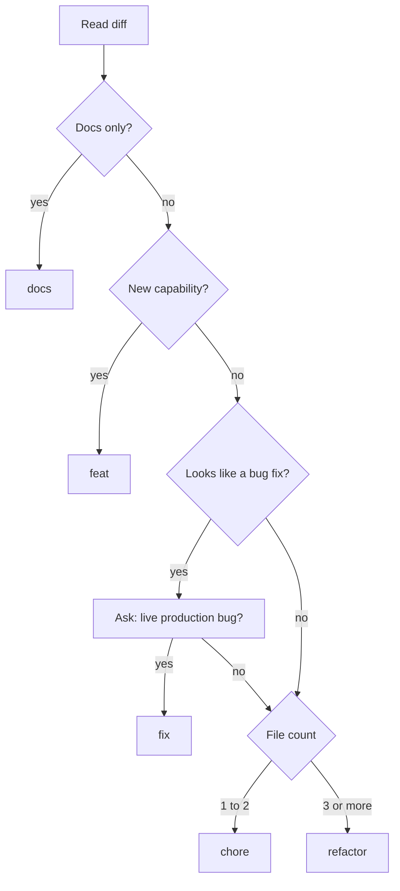

# Type selection

## Contents
- File count
- Decision flow
- The live-production question
- Edge cases

## File count

Count changed files in the diff, excluding: lockfiles, generated files, snapshots, `CHANGELOG.md`, and the version field edit in the manifest (for example `package.json`). Everything else counts, including tests and docs files. Renames count as one file.

## Decision flow

First match wins:

1. Only documentation files changed: `docs`.
2. Adds a user-visible or API-visible capability: `feat`, any file count.
3. Looks like a bug fix: ask the question below. Yes means `fix`.
4. Otherwise by file count: 1 to 2 files is `chore`, 3 or more is `refactor`.

## The live-production question

Ask exactly one question and wait for the answer:

> Is this fixing a bug that is live in production?

- Yes: `fix(scope)`. Patch bump.
- No: never use `fix`. Fall through to the file count rule.
- Never infer the answer from the branch name, commit messages, or issue labels.

## Edge cases

- A "small update" that touches 3 or more files becomes `refactor`, even if the user called it a chore.
- A `feat` that also refactors: stay `feat`. Mention the refactor in a bullet.
- Dependency bumps with code changes to adapt: count the code files. 1 to 2 files is `chore(deps)`, otherwise `refactor`.
- Mixed docs and code: not docs-only, so classify by the code changes.
- Repo-wide change (formatting pass, license header, tooling migration): omit the scope.
- Monorepo: scope is the package directory name as used in recent history. If the diff spans several packages, omit the scope.
